# 🤖 MyAIApp Platform

A premium, Django-based all-in-one AI SaaS platform. Features a modern dark UI with multiple AI-powered tools, all running on the **Google Gemini API**.

---

## 📸 Screenshots

### 🔐 Login
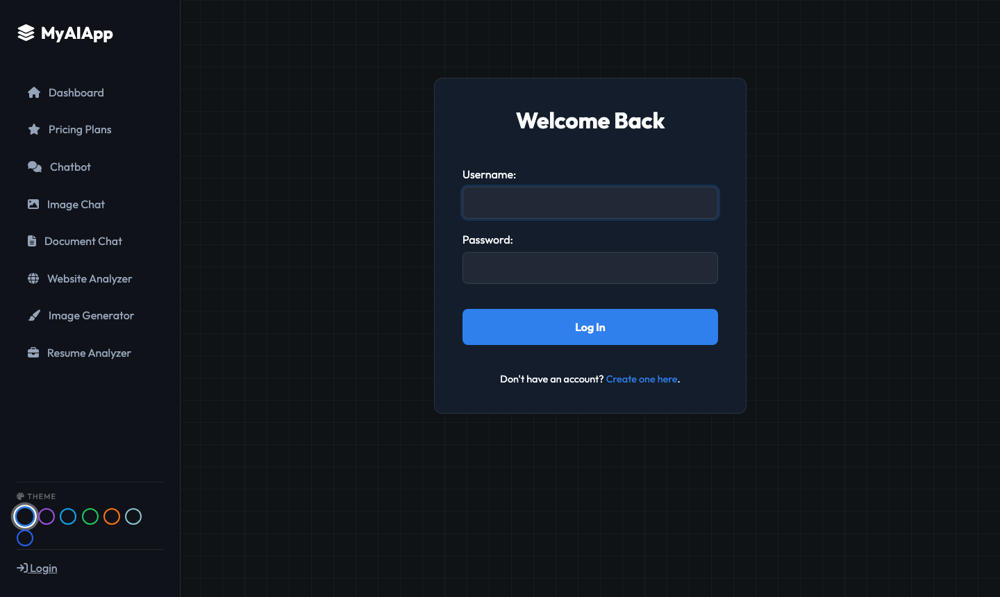

### 🏠 Dashboard
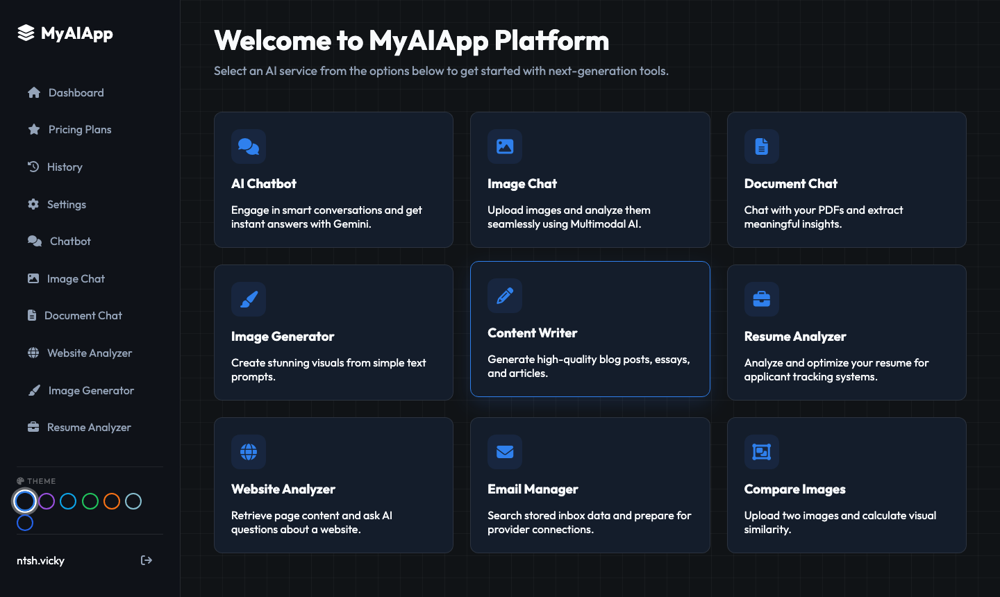

### 💬 AI Chatbot
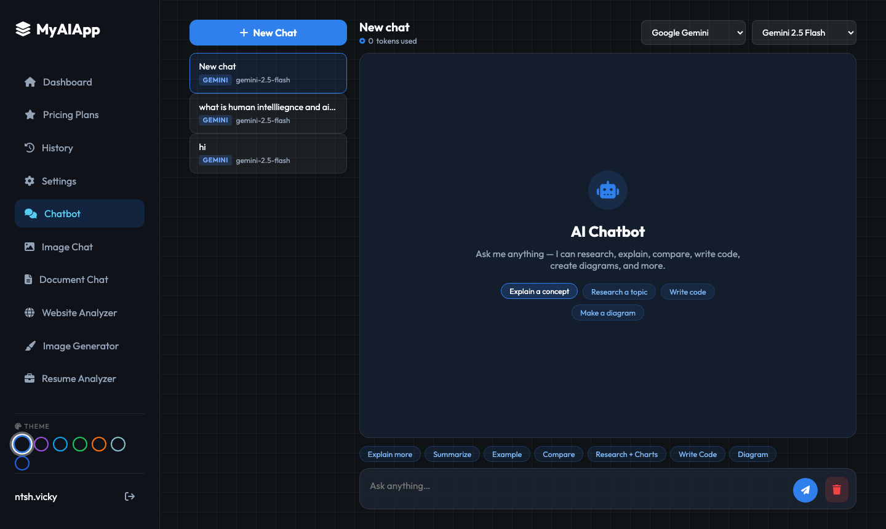

### 🖼️ Image Chat (Multimodal)
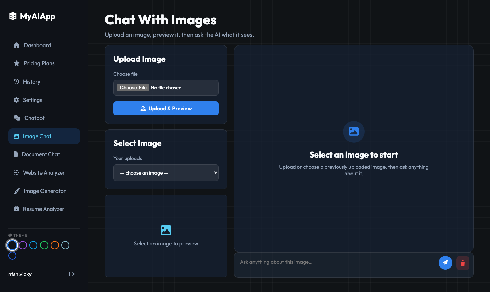

### 📄 Document Chat
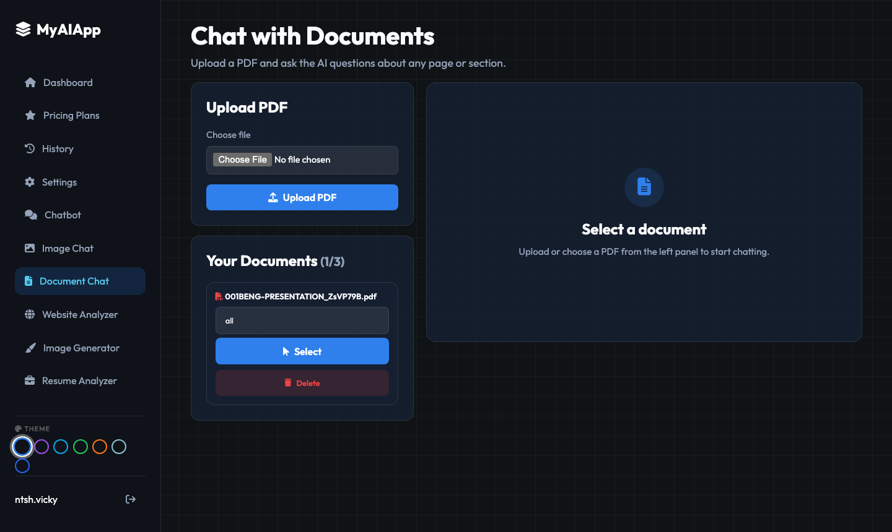

### 🌐 Website Analyzer


### 🎨 Image Generator
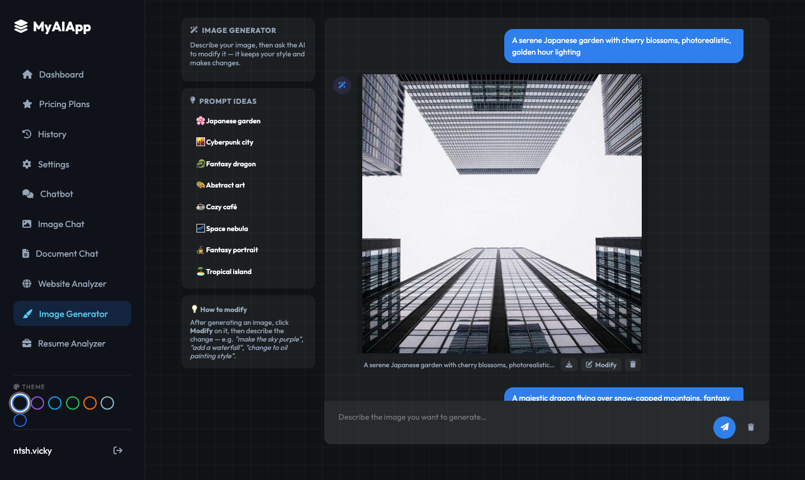

### 📋 Resume Analyzer
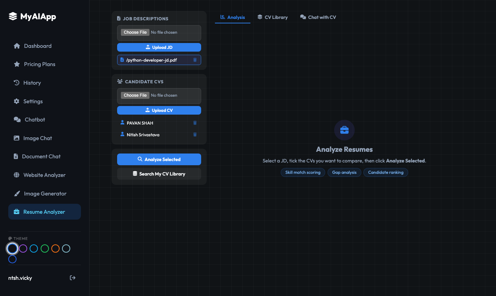

### 📧 Email Manager
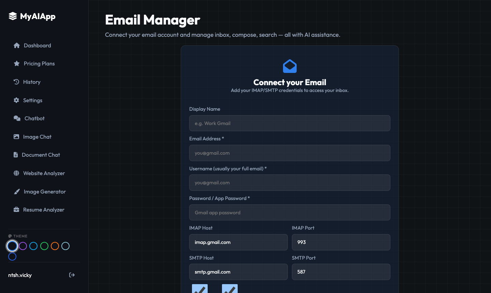

### ✍️ Content Writer
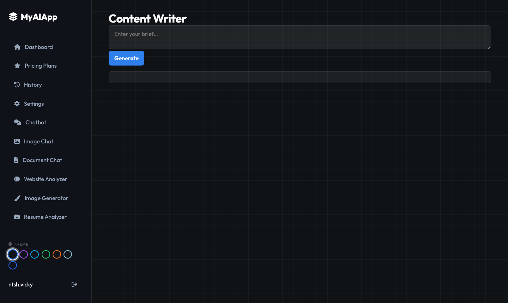

### 🔍 Compare Images
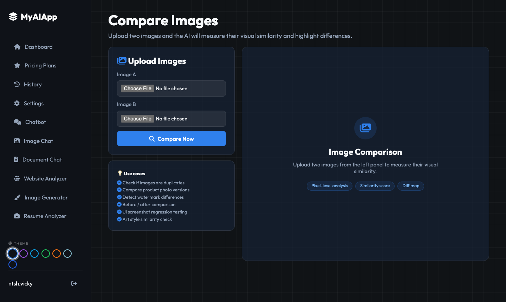

### 💳 Pricing Plans
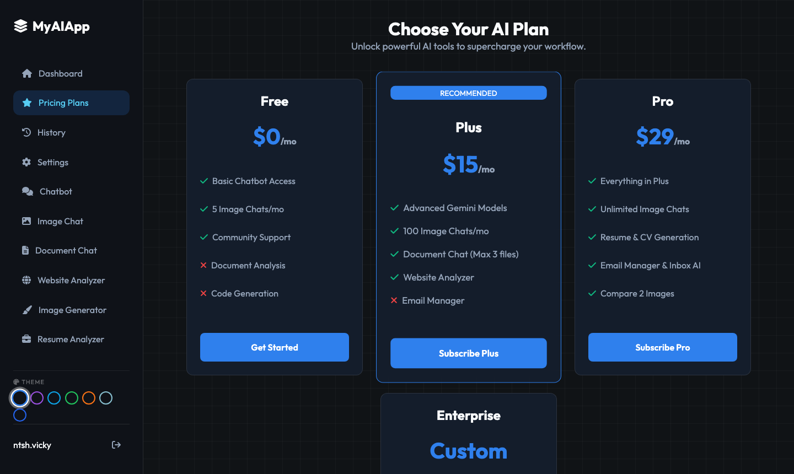

### 📜 History
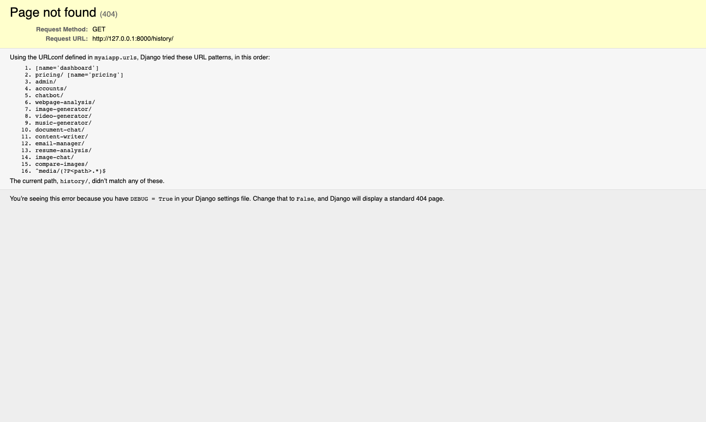

### ⚙️ Settings
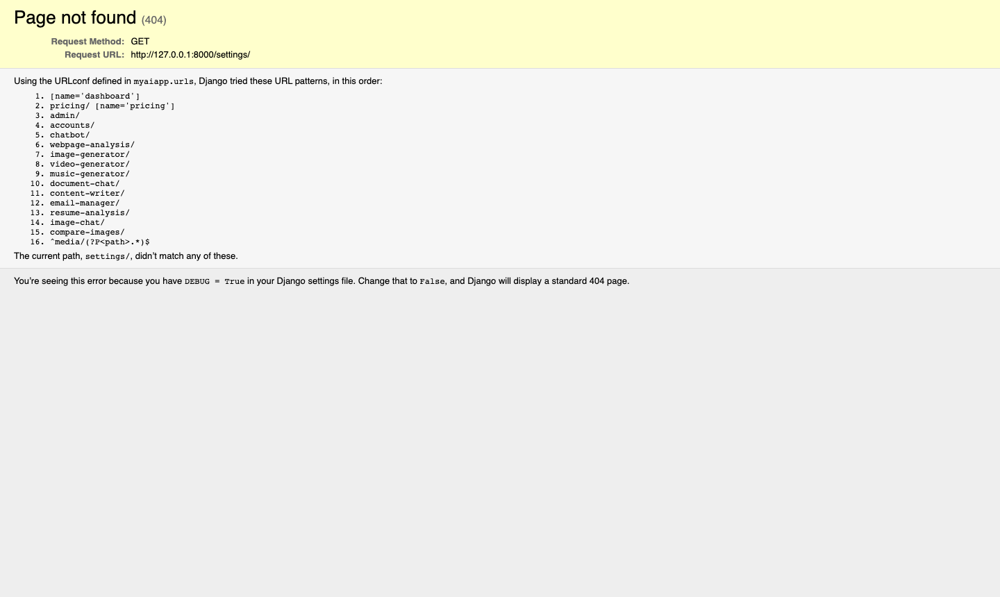

---

## 🌟 Features

| Feature | Description |
|---|---|
| **AI Chatbot** | Multi-turn chat with Gemini. Supports code highlighting, Mermaid diagrams, and markdown. |
| **Image Chat** | Upload images and ask questions using Gemini's vision multimodal capabilities. |
| **Document Chat** | Upload PDFs or text files and chat with their content. |
| **Website Analyzer** | Enter a URL once, then ask the AI anything about the page content. |
| **Image Generator** | Chat-based image generation — generate, then ask AI to modify (keeps style + adds changes). |
| **Resume Analyzer** | Upload JDs and CVs. AI scores, ranks candidates, extracts contact info, rewrites CVs, and enables per-CV chat sessions. |
| **Email Manager** | Connect via IMAP/SMTP. Read inbox, compose, search, and use AI to write or summarize emails. |
| **Content Writer** | Generate blog posts, essays, and articles with AI. |
| **Compare Images** | Upload two images and get a visual similarity score and diff analysis. |
| **Pricing Plans** | Tiered subscription plans with feature gating. |
| **History** | Full log of AI token usage across all services. |
| **Settings** | Manage account details and preferences. |
| **Theme Switcher** | 7 colour themes (dark, purple, cyan, green, orange, light, navy). |

---

## 🚀 Quick Start

### 1. Clone & Install

```bash
git clone https://github.com/ntshvicky/myaiapp_template.git
cd myaiapp_template
pip install -r requirements.txt
```

### 2. Configure Environment

```bash
cp .env.example .env
```

Edit `.env`:

```env
GEMINI_API_KEY=your_gemini_api_key_here
SECRET_KEY=your_django_secret_key
DEBUG=True

# Optional — for Email Manager
# IMAP/SMTP credentials are entered per-user inside the app
```

Get a free Gemini API key at [aistudio.google.com](https://aistudio.google.com/app/apikey).

### 3. Set Up Database

```bash
python manage.py migrate
python manage.py createsuperuser
```

### 4. Run

```bash
python manage.py runserver
```

Visit **http://127.0.0.1:8000** — log in and start using the tools.

---

## 🏗️ Architecture

```
myaiapp_template/
├── myaiapp/                  # Django project settings & root URLs
├── services/
│   ├── chatbot/              # AI chatbot (Gemini text)
│   ├── image_chat/           # Multimodal image chat
│   ├── document_chat/        # PDF / text chat
│   ├── webpage_analysis/     # Website URL analyzer
│   ├── image_generator/      # Text-to-image (Gemini Imagen)
│   ├── resume_analysis/      # CV scoring, rewrite, chat
│   ├── email_manager/        # IMAP/SMTP email client
│   ├── content_writer/       # Article/blog generation
│   ├── compare_images/       # Visual similarity comparison
│   ├── gemini.py             # Shared Gemini API client
│   ├── ai_router.py          # Token usage tracking
│   └── access.py             # Feature access / plan gating
├── templates/                # Django HTML templates
├── static/
│   ├── css/style.css         # Global styles + all component CSS
│   └── js/common.js          # Theme switcher, active nav
└── docs/screenshots/         # UI screenshots
```

---

## 🧩 Tech Stack

- **Backend**: Django 4.2, SQLite
- **AI**: Google Gemini API (`gemini-2.5-flash`, Gemini image models)
- **Frontend**: Vanilla JS, CSS custom properties (no framework)
- **Charts**: Chart.js
- **Documents**: python-docx (CV download as Word)
- **PDF parsing**: PyMuPDF (`fitz`)
- **Email**: Python `imaplib` + `smtplib`
- **Screenshots**: Playwright (dev tool)

---

## 📦 Requirements

```
django
google-genai
python-dotenv
pymupdf
python-docx
pillow
```

Install all:

```bash
pip install -r requirements.txt
```

---

## 🧪 Tests

```bash
python manage.py test myaiapp
```

---

## 📄 License

MIT — free to use, modify, and deploy.
